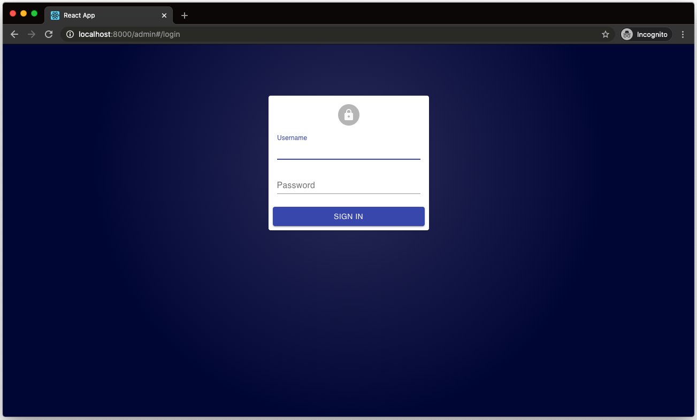

# FastAPI + React Template · [](https://circleci.com/gh/Buuntu/fastapi-react) [](LICENSE) [](https://dependabot.com)

<div>
  &nbsp; &nbsp;  &nbsp; &nbsp;  &nbsp;&nbsp;&nbsp;
 
</div>

This project serves as a template for bootstrapping a FastAPI and React project
using a modern stack.

## Features

- **[FastAPI](https://fastapi.tiangolo.com/)** (Python 3.8)
  - **JWT** authentication using OAuth2 and PyJWT
- **[React](https://reactjs.org/)** (with Typescript)
  - [react-router v5](https://reacttraining.com/react-router/) to handle routing
  - [Utility functions](##Frontend-Utilities) and [higher-order components](##Higher-Order-Components) for
    handling authentication and storing JWT in local storage
- **[PostgreSQL](https://www.postgresql.org/)** for the database
- **[SqlAlchemy](https://www.sqlalchemy.org/)** for ORM
- **[Alembic](https://alembic.sqlalchemy.org/en/latest/)** for database
  migrations
- **[Pytest](https://docs.pytest.org/en/latest/)** for backend tests
  - Includes test database/client, transaction based tests, and user fixtures
  - See [Testing section](##Testing) for more
- **[Prettier](https://prettier.io/)**/**[ESLint](https://eslint.org/)** (Airbnb
  style guide)
- **[Docker Compose](https://docs.docker.com/compose/)** for development
- **[Nginx](https://www.nginx.com/)** as a reverse proxy to allow
  backend/frontend on the same port
- **[MaterialUI](https://material-ui.com/)** using recommended
  [CSS-in-JS](https://material-ui.com/styles/basics/) styling.
- **[react-admin](https://github.com/marmelab/react-admin)** for the admin
  dashboard
  - Using JWT authentication requiring superuser privileges

## Background

This project is meant as a lightweight/React alternative to [FastAPI's official
fullstack project](https://github.com/tiangolo/full-stack-fastapi-postgresql).
If you want a more comprehensive project in Vue, I would suggest you start
there.

Most of the boilerplate backend code is taken from that project or the [FastAPI
official docs](https://fastapi.tiangolo.com/). This is mainly setup to help with
development, it has no opinions on how you should deploy your code.

## Quick Start

First, install cookiecutter if you don't already have it:

```bash
pip install cookiecutter
```

Then, in the directory you want your project to live:

```bash
cookiecutter gh:Buuntu/fastapi-react
```

This will ask for the following variables to be set:

- project_name [default fastapi-react]
- project_slug [default fastapi-react]
- port [default 8000]
- postgres_user [default postgres]
- postgres_password [default password]
- postgres_database [default app]
- superuser_email [default admin@example.com]
- superuser_password [default password]
- secret_key [default super_secret]

and will create a directory called whatever you set for `project_slug`.

## Develop

Change into your project directory and run:

```bash
chmod +x scripts/build.sh
./scripts/build.sh
```

This will build and run the docker containers, run the alembic migrations, and
load the initial data (a test user).

It may take a while to build the first time it's run since it needs to fetch all
the docker images.

Once you've built the images once, you can simply use regular `docker-compose`
commands to manage your development environment, for example to start your
containers:

```bash
docker-compose up -d
```

Once this finishes you can navigate to the port set during setup (default is
`localhost:8000`), you should see the slightly modified create-react-app page:


_Note: If you see an Nginx error at first with a `502: Bad Gateway` page, you
may have to wait for webpack to build the development server (the nginx
container builds much more quickly)._

The backend docs will be at `http://localhost:8000/api/docs`. 

Backend routes will be at `http://localhost:8000/api`.

## Admin Dashboard

This project uses [react-admin](https://marmelab.com/react-admin/) for a highly
configurable admin dashboard.

After starting the project, navigate to `http://localhost:8000/admin`. You
should see a login screen. Use the username/password you set for the superuser
on project setup.

_NOTE: regular users will not be able to access the admin dashboard_



You should now see a list of users which you can edit, add, and delete. The
table is configured with the REST endpoints to the FastAPI `/users` routes in
the backend.


The admin dashboard is kept in the `frontend/src/admin` directory to keep it
separate from the regular frontend.

## Security

To generate a secure key used for encrypting/decrypting the JSON Web Tokens, you
can run this command:

```bash
openssl rand -hex 32
```

The default is fine for development but you will want something more secure for
production.

You can either set this on project setup as `secret_key` or manually edit the
Python `SECRET_KEY` variable in `backend/app/core/security.py`.

## Testing

This project comes with Pytest and a few Pytest fixtures for easier mocking. The
fixtures are all located in `backend/conftest.py` within your project directory.

All tests are configured to run on a test database using [SQLAlchemy
transactions](https://docs.sqlalchemy.org/en/13/orm/session_transaction.html) to
reset the testing state on each function. This is to avoid a database call
affecting the state of a different state.

To use the test client, simply create a Pytest file and include `test_db` as an
argument to your test method:

```python
def test_user(test_db):
    # This is an empty test database and an instance of a SQLAlchemy Session class
    assert test_db.query(models.User).all()
```

To use an unauthenticated test client, use `client`:

```python
def test_get_users(client):
    test_client.get("/api/v1/users")
    assert response.status_code == 200
```

Or if you need an authenticated client using OAuth2 and JWTs:

```python
def test_user_me(client, user_token_headers):
    response = client.get(
      "/api/v1/users/me",
      headers=user_token_headers,
    )
    assert response.status_code == 200
```

Since OAuth2 expects the access token in the headers, you will need to pass in
`user_token_headers` as the `headers` argument in any client request that
requires authentication.

For a test user, use `test_user`:

```python
def test_user_exists(test_user):
    assert test_user.email == "admin@example.com"
```

For a superuser, use `test_superuser`.

Superuser routes requires superuser headers:

```python
def test_superuser_method(client, superuser_token_headers):
    # This route requires superuser privelages
    assert client.get("/api/v1/users", headers=superuser_token_headers)
```

## Frontend Utilities

There are a few helper methods to handle authentication in `frontend/src/utils`.
These store the JWT returned by FastAPI in local storage. Even though this
doesn't create any real added security, we prevent loading routes that might be
protected on the frontend, which results in a better UX experience.

```typescript
// in src/utils/auth.ts

/**
 *  Handles authentication with backend and stores in JWT in local storage
 *  @returns true|false
 **/
const login = (email: string, password: string) => bool;
```

```typescript
// in src/utils/auth.ts

// clears token from local storage
const logout = (email: string, password: string) => void;
```

### Higher-Order Components

<details><summary>PrivateRoute</summary>
<p>

This handles routes that require authentication. It will automatically check
whether the correct token with the "user" permissions is present and if not,
redirect to the home page.

#### Usage:

```JSX
// in src/Routes.tsx
import { Switch } from 'react-router-dom';

// Replace this with your component
import { ProtectecComponent } from 'components';

const Routes = () => (
  <Switch>
    <PrivateRoute path="/protected_route" component={ProtectedComponent} />
  </Switch>
);
```

</p>
</details>

## Contributing

Contributing is more than welcome. Please read the [Contributing
doc](CONTRIBUTING.md) to find out more.
