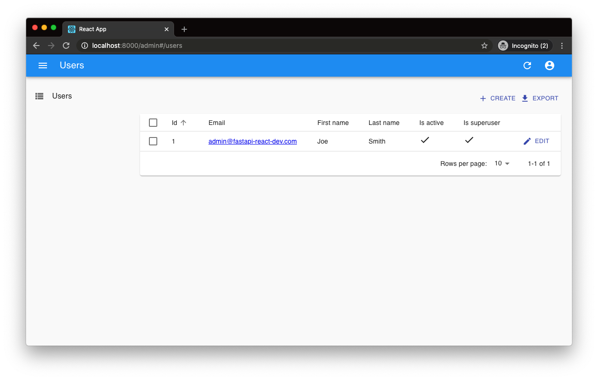

# FastAPI + React Template · [](https://circleci.com/gh/Buuntu/fastapi-react) [](LICENSE) [](https://dependabot.com)

  &nbsp; &nbsp;  &nbsp;&nbsp;&nbsp;


This project serves as a template for bootstrapping a FastAPI and React project
using a modern stack.

## Features

1. **[FastAPI](https://fastapi.tiangolo.com/)** (Python 3.8)
2. **[React](https://reactjs.org/)** (with Typescript)
3. **[PostgreSQL](https://www.postgresql.org/)** for the database
4. **[SqlAlchemy](https://www.sqlalchemy.org/)** for ORM
5. **[Alembic](https://alembic.sqlalchemy.org/en/latest/)** for database
   migrations
6. **[Pytest](https://docs.pytest.org/en/latest/)** for backend tests
7. **[Prettier](https://prettier.io/)**/**[ESLint](https://eslint.org/)**
   (Airbnb style guide)
8. **[Docker Compose](https://docs.docker.com/compose/)** for development
9. **[Nginx](https://www.nginx.com/)** as a reverse proxy to allow
   backend/frontend on the same port
10. [**MaterialUI**](https://material-ui.com/) for styling
11. [**react-admin**](https://github.com/marmelab/react-admin) for the admin
    dashboard

## Background

This project is meant as a lightweight/React alternative to [FastAPI's official
fullstack project](https://github.com/tiangolo/full-stack-fastapi-postgresql).
If you want a fullstack, comprehensive project in Vue, I would suggest you start
there.

Most of the boilerplate backend code is taken from that project or the [FastAPI
official docs](https://fastapi.tiangolo.com/). This is mainly setup to help with
development, it has no opinions on how you should deploy your code.

## Quick Start

First, install cookiecutter if you don't already have it:

```bash
pip install cookiecutter
```

Then, in the directory you want your project to live:

```bash
cookiecutter gh:Buuntu/fastapi-react
```

This will ask for the following variables to be set:

- project_name [default fastapi-react]
- project_slug [default fastapi-react]
- port [default 8000]
- postgres_user [default postgres]
- postgres_password [default password]

and will create a directory called whatever you set for `project_slug`.

## Develop

Change into your project directory and run:

```bash
docker-compose up -d
docker-compose run --rm backend alembic upgrade head
```

This will take a while to build the first time it's run since it needs to fetch
all the docker images.

Once this finishes you can navigate to the port set during setup (default is
`localhost:8000`), you should see the slightly modified create-react-app page:


*Note: If you see an Nginx error at first with a `502: Bad Gateway` page, you
may  have to wait for webpack to build the development server (the nginx
container builds much more quickly).*

The backend docs will be at `http://localhost:8000/api/docs`.

Backend routes will be at `http://localhost:8000/api`.

## Admin Dashboard

This project uses [react-admin](https://marmelab.com/react-admin/) for a highly
configurable admin dashboard.

After starting the project, navigate to `http://localhost:8000/admin`.  You
should see a list of users, which you can edit, add, and delete. These are all
based off of the `users` routes in the backend.



The admin dashboard is kept in the `frontend/src/admin` directory to keep it
separate from the regular frontend.

## Contributing

Contributing is more than welcome.  Please read the [Contributing
doc](CONTRIBUTING.md) to find out more.
