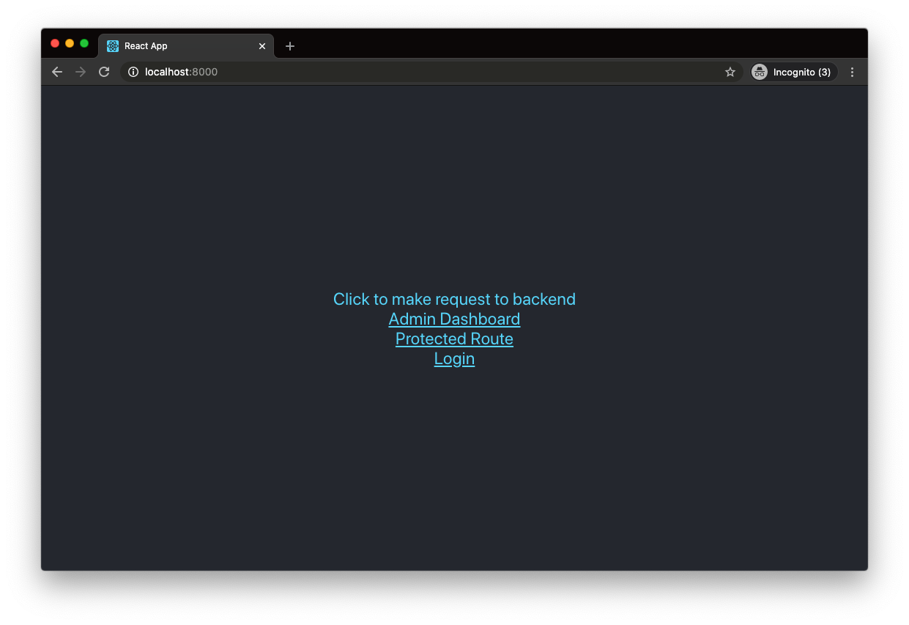

# FastAPI + React Template · [](https://circleci.com/gh/Buuntu/fastapi-react) [](LICENSE) [](https://dependabot.com)

<div>
  &nbsp; &nbsp;  &nbsp; &nbsp;  &nbsp;&nbsp;&nbsp;
 
</div>

This project serves as a template for bootstrapping a FastAPI and React project
using a modern stack.

## Features

- **[FastAPI](https://fastapi.tiangolo.com/)** (Python 3.8)
- **[React](https://reactjs.org/)** (with Typescript)
- **[PostgreSQL](https://www.postgresql.org/)** for the database
- **[SqlAlchemy](https://www.sqlalchemy.org/)** for ORM
- **[Alembic](https://alembic.sqlalchemy.org/en/latest/)** for database
  migrations
- **[Pytest](https://docs.pytest.org/en/latest/)** for backend tests
  - Includes test database, client, and user fixtures
- **[Prettier](https://prettier.io/)**/**[ESLint](https://eslint.org/)** (Airbnb
  style guide)
- **[Docker Compose](https://docs.docker.com/compose/)** for development
- **[Nginx](https://www.nginx.com/)** as a reverse proxy to allow
  backend/frontend on the same port
- **[MaterialUI](https://material-ui.com/)** for styling
- **[react-admin](https://github.com/marmelab/react-admin)** for the admin
  dashboard
  - Using JWT authentication and login/redirects configured based on status
    codes
- **JWT** authentication using OAuth2 and PyJWT

## Background

This project is meant as a lightweight/React alternative to [FastAPI's official
fullstack project](https://github.com/tiangolo/full-stack-fastapi-postgresql).
If you want a more comprehensive project in Vue, I would suggest you start
there.

Most of the boilerplate backend code is taken from that project or the [FastAPI
official docs](https://fastapi.tiangolo.com/). This is mainly setup to help with
development, it has no opinions on how you should deploy your code.

## Quick Start

First, install cookiecutter if you don't already have it:

```bash
pip install cookiecutter
```

Then, in the directory you want your project to live:

```bash
cookiecutter gh:Buuntu/fastapi-react
```

This will ask for the following variables to be set:

- project_name [default fastapi-react]
- project_slug [default fastapi-react]
- port [default 8000]
- postgres_user [default postgres]
- postgres_password [default password]
- postgres_database [default app]
- initial_user_email [default admin@example.com]
- initial_user_password [default password]
- secret_key [default super_secret]

and will create a directory called whatever you set for `project_slug`.

## Develop

Change into your project directory and run:

```bash
chmod +x scripts/build.sh
./scripts/build.sh
```

This will build and run the docker containers, run the alembic migrations, and
load the initial data (a test user).

It may take a while to build the first time it's run since it needs to fetch all
the docker images.

Once you've built the images once, you can simply use regular `docker-compose`
commands to manage your development environment, for example to start your
containers:

```bash
docker-compose up -d
```

Once this finishes you can navigate to the port set during setup (default is
`localhost:8000`), you should see the slightly modified create-react-app page:



_Note: If you see an Nginx error at first with a `502: Bad Gateway` page, you
may have to wait for webpack to build the development server (the nginx
container builds much more quickly)._

The backend docs will be at `http://localhost:8000/api/docs`. 

Backend routes will be at `http://localhost:8000/api`.

## Admin Dashboard

This project uses [react-admin](https://marmelab.com/react-admin/) for a highly
configurable admin dashboard.

After starting the project, navigate to `http://localhost:8000/admin`. You
should see a login screen. Use the username/password you set for the initial
user on project setup.


You should now see a list of users which you can edit, add, and delete. The
table is configured with the REST endpoints to the FastAPI `/users` routes in
the backend.


The admin dashboard is kept in the `frontend/src/admin` directory to keep it
separate from the regular frontend.

## Security

To generate a secure key used for encrypting/decrypting the JSON Web Tokens, you can run this command:

```bash
openssl rand -hex 32
```

The default is fine for development but you will want something more secure for
production.

You can either set this on project setup as `secret_key` or manually edit the
Python `SECRET_KEY` variable in `backend/app/core/security.py`.

## Contributing

Contributing is more than welcome. Please read the [Contributing
doc](CONTRIBUTING.md) to find out more.
